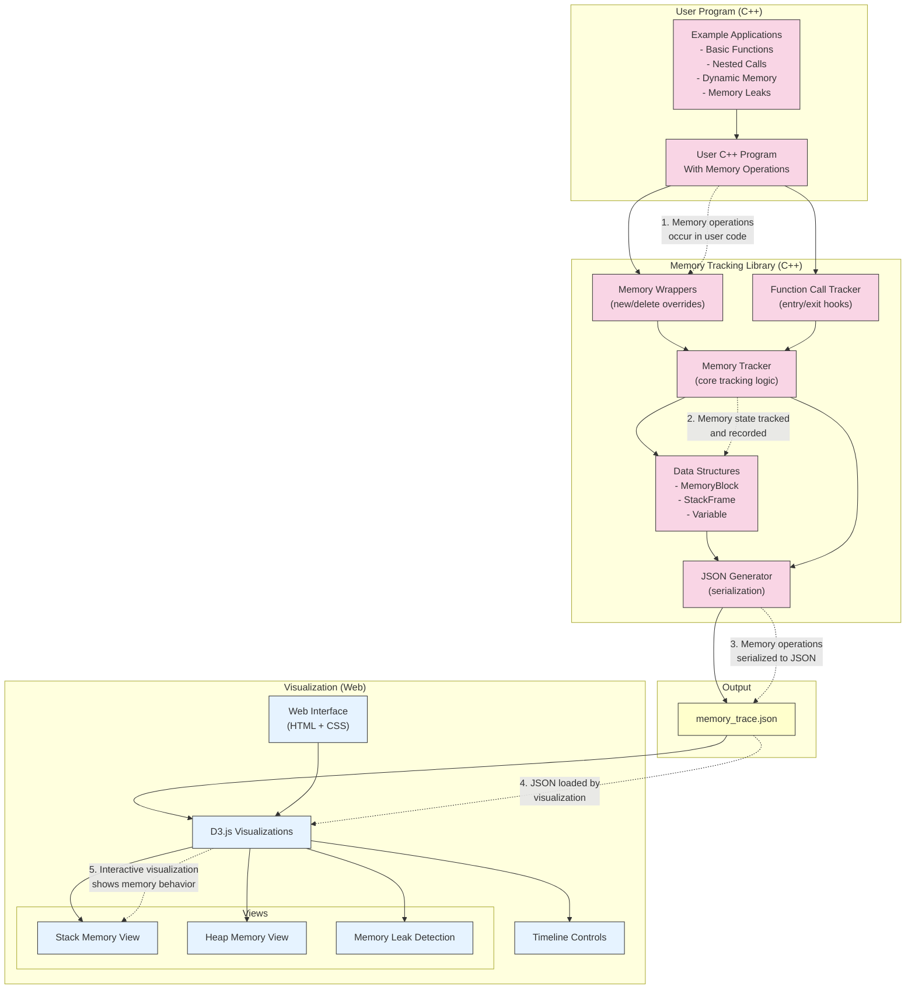

```mermaid
flowchart TD
    subgraph "User Program (C++)"
        UserCode["User C++ Program\nWith Memory Operations"]
        ExampleApps["Example Applications\n- Basic Functions\n- Nested Calls\n- Dynamic Memory\n- Memory Leaks"]
    end

    subgraph "Memory Tracking Library (C++)"
        MemWrappers["Memory Wrappers\n(new/delete overrides)"]
        FuncTracker["Function Call Tracker\n(entry/exit hooks)"]
        MemTracker["Memory Tracker\n(core tracking logic)"]
        JsonGen["JSON Generator\n(serialization)"]
        
        DataStructures["Data Structures\n- MemoryBlock\n- StackFrame\n- Variable"]
    end

    subgraph "Output"
        JsonFile["memory_trace.json"]
    end

    subgraph "Visualization (Web)"
        WebUI["Web Interface\n(HTML + CSS)"]
        D3["D3.js Visualizations"]
        TimelineControls["Timeline Controls"]
        
        subgraph "Views"
            StackView["Stack Memory View"]
            HeapView["Heap Memory View"]
            LeakDetector["Memory Leak Detection"]
        end
    end

    %% Connections between components
    UserCode --> MemWrappers
    UserCode --> FuncTracker
    ExampleApps --> UserCode
    
    MemWrappers --> MemTracker
    FuncTracker --> MemTracker
    MemTracker --> DataStructures
    DataStructures --> JsonGen
    MemTracker --> JsonGen
    
    JsonGen --> JsonFile
    
    JsonFile --> D3
    D3 --> StackView
    D3 --> HeapView
    D3 --> LeakDetector
    D3 --> TimelineControls
    WebUI --> D3
    
    %% Data flow
    classDef cpp fill:#f9d5e5,stroke:#333,stroke-width:1px
    classDef data fill:#ffffcc,stroke:#333,stroke-width:1px
    classDef web fill:#e6f3ff,stroke:#333,stroke-width:1px
    
    class UserCode,ExampleApps,MemWrappers,FuncTracker,MemTracker,JsonGen,DataStructures cpp
    class JsonFile data
    class WebUI,D3,TimelineControls,StackView,HeapView,LeakDetector web

    %% Labels for process flow
    UserCode -.-> |"1. Memory operations\noccur in user code"| MemWrappers
    MemTracker -.-> |"2. Memory state tracked\nand recorded"| DataStructures
    JsonGen -.-> |"3. Memory operations\nserialized to JSON"| JsonFile
    JsonFile -.-> |"4. JSON loaded by\nvisualization"| D3
    D3 -.-> |"5. Interactive visualization\nshows memory behavior"| StackView
```
