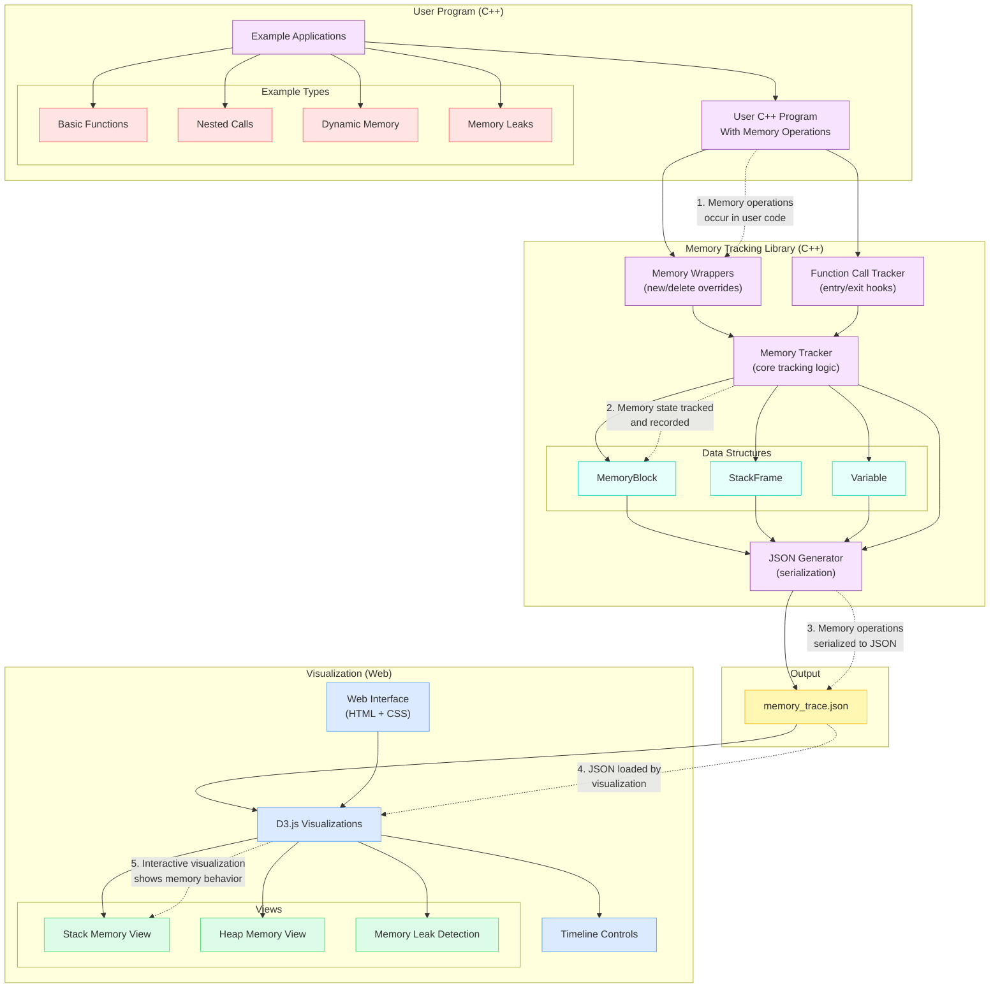

```mermaid
flowchart TD
    subgraph "User Program (C++)"
        UserCode["User C++ Program\nWith Memory Operations"]
        ExampleApps["Example Applications"]
        
        subgraph "Example Types"
            Ex1["Basic Functions"]
            Ex2["Nested Calls"]
            Ex3["Dynamic Memory"]
            Ex4["Memory Leaks"]
        end
        
        ExampleApps --> Ex1
        ExampleApps --> Ex2
        ExampleApps --> Ex3
        ExampleApps --> Ex4
    end

    subgraph "Memory Tracking Library (C++)"
        MemWrappers["Memory Wrappers\n(new/delete overrides)"]
        FuncTracker["Function Call Tracker\n(entry/exit hooks)"]
        MemTracker["Memory Tracker\n(core tracking logic)"]
        JsonGen["JSON Generator\n(serialization)"]
        
        subgraph "Data Structures"
            DS1["MemoryBlock"]
            DS2["StackFrame"]
            DS3["Variable"]
        end
    end

    subgraph "Output"
        JsonFile["memory_trace.json"]
    end

    subgraph "Visualization (Web)"
        WebUI["Web Interface\n(HTML + CSS)"]
        D3["D3.js Visualizations"]
        TimelineControls["Timeline Controls"]
        
        subgraph "Views"
            StackView["Stack Memory View"]
            HeapView["Heap Memory View"]
            LeakDetector["Memory Leak Detection"]
        end
    end

    %% Connections between components
    UserCode --> MemWrappers
    UserCode --> FuncTracker
    ExampleApps --> UserCode
    
    MemWrappers --> MemTracker
    FuncTracker --> MemTracker
    MemTracker --> DS1
    MemTracker --> DS2
    MemTracker --> DS3
    DS1 --> JsonGen
    DS2 --> JsonGen
    DS3 --> JsonGen
    MemTracker --> JsonGen
    
    JsonGen --> JsonFile
    
    JsonFile --> D3
    D3 --> StackView
    D3 --> HeapView
    D3 --> LeakDetector
    D3 --> TimelineControls
    WebUI --> D3
    
    %% Data flow
    classDef cpp fill:#f8e3ff,stroke:#9c51b6,stroke-width:1px
    classDef dataStructure fill:#e6fffa,stroke:#2dd4bf,stroke-width:1px
    classDef examples fill:#ffe4e4,stroke:#f87171,stroke-width:1px
    classDef data fill:#fff7b2,stroke:#fbbf24,stroke-width:1px
    classDef web fill:#dbeafe,stroke:#60a5fa,stroke-width:1px
    classDef views fill:#dcfce7,stroke:#4ade80,stroke-width:1px
    
    class UserCode,ExampleApps cpp
    class MemWrappers,FuncTracker,MemTracker,JsonGen cpp
    class DS1,DS2,DS3 dataStructure
    class Ex1,Ex2,Ex3,Ex4 examples
    class JsonFile data
    class WebUI,D3,TimelineControls web
    class StackView,HeapView,LeakDetector views

    %% Labels for process flow
    UserCode -.-> |"1. Memory operations\noccur in user code"| MemWrappers
    MemTracker -.-> |"2. Memory state tracked\nand recorded"| DS1
    JsonGen -.-> |"3. Memory operations\nserialized to JSON"| JsonFile
    JsonFile -.-> |"4. JSON loaded by\nvisualization"| D3
    D3 -.-> |"5. Interactive visualization\nshows memory behavior"| StackView
```
