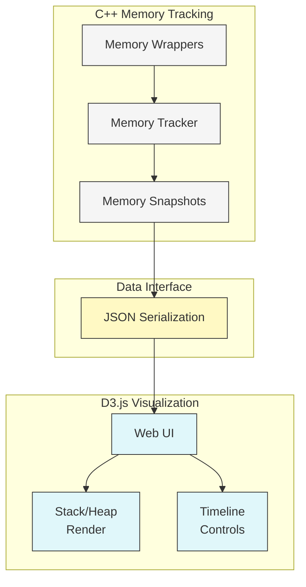

```mermaid
flowchart TB
    subgraph "C++ Memory Tracking"
        Wrappers["Memory Wrappers"]
        Tracker["Memory Tracker"]
        Snapshots["Memory Snapshots"]
    end
    
    subgraph "Data Interface"
        JSON["JSON Serialization"]
    end
    
    subgraph "D3.js Visualization"
        Frontend["Web UI"]
        Render["Stack/Heap\nRender"]
        Timeline["Timeline\nControls"]
    end
    
    Wrappers --> Tracker
    Tracker --> Snapshots
    Snapshots --> JSON
    JSON --> Frontend
    Frontend --> Render
    Frontend --> Timeline
    
    classDef cpp fill:#f5f5f5,stroke:#333,stroke-width:1px
    classDef data fill:#fff9c4,stroke:#333,stroke-width:1px
    classDef vis fill:#e0f7fa,stroke:#333,stroke-width:1px
    
    class Wrappers,Tracker,Snapshots cpp
    class JSON data
    class Frontend,Render,Timeline vis
```
