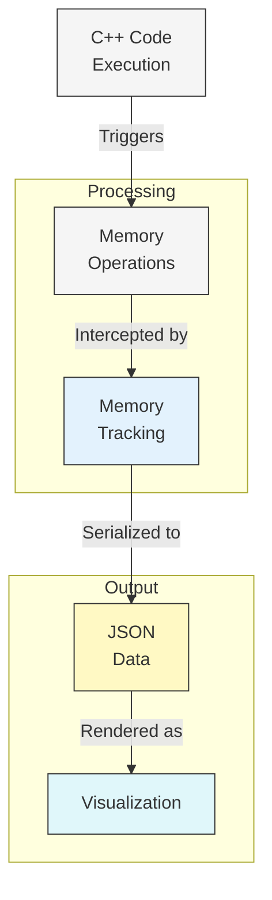

```mermaid
flowchart TD
    Code["C++ Code\nExecution"] --> |"Triggers"| Mem["Memory\nOperations"]
    
    subgraph Processing
    Mem --> |"Intercepted by"| Track["Memory\nTracking"]
    end
    
    subgraph Output
    direction LR
    Track --> |"Serialized to"| JSON["JSON\nData"]
    JSON --> |"Rendered as"| Vis["Visualization"]
    end
    
    class Code,Mem,Track,JSON,Vis roundedge
    style Code fill:#f5f5f5,stroke:#333,stroke-width:1px
    style Mem fill:#f5f5f5,stroke:#333,stroke-width:1px
    style Track fill:#e3f2fd,stroke:#333,stroke-width:1px
    style JSON fill:#fff9c4,stroke:#333,stroke-width:1px
    style Vis fill:#e0f7fa,stroke:#333,stroke-width:1px
```
