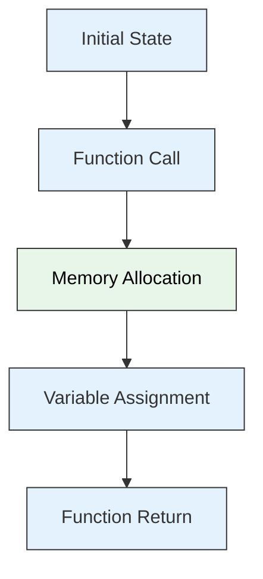

```mermaid
flowchart TD
    Step1["Initial State"]
    Step2["Function Call"]
    Step3["Memory Allocation"]
    Step4["Variable Assignment"]
    Step5["Function Return"]
    
    Step1 --> Step2 --> Step3 --> Step4 --> Step5
    
    style Step1 fill:#e3f2fd,stroke:#333
    style Step2 fill:#e3f2fd,stroke:#333
    style Step3 fill:#e8f5e9,stroke:#333,color:black
    style Step4 fill:#e3f2fd,stroke:#333
    style Step5 fill:#e3f2fd,stroke:#333
```
