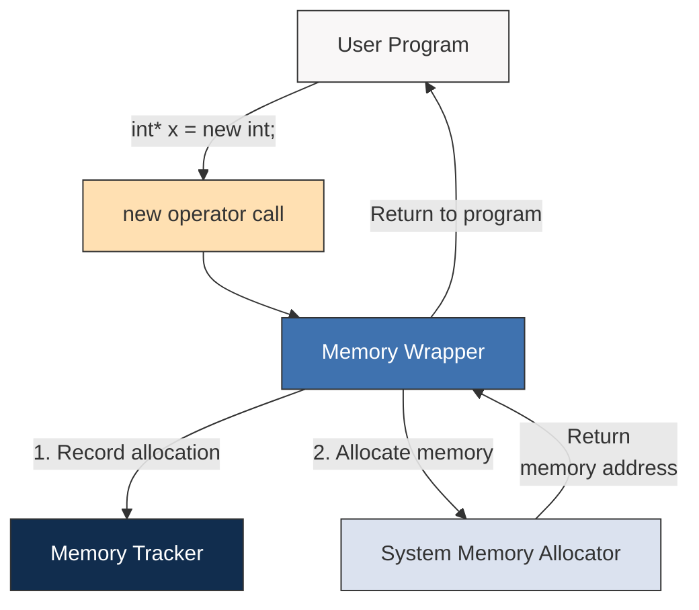

```mermaid
flowchart TD
    Program["User Program"]
    New["new operator call"]
    MemWrap["Memory Wrapper"]
    SysMem["System Memory Allocator"]
    Tracker["Memory Tracker"]
    
    Program -->|"int* x = new int;"| New
    New --> MemWrap
    MemWrap -->|"1. Record allocation"| Tracker
    MemWrap -->|"2. Allocate memory"| SysMem
    SysMem -->|"Return <br>memory address"| MemWrap
    MemWrap -->|"Return to program"| Program
    
    style Program fill:#f9f7f7,stroke:#333
    style New fill:#ffe0b2,stroke:#333
    style MemWrap fill:#3f72af,stroke:#333,color:white
    style Tracker fill:#112d4e,stroke:#333,color:white
    style SysMem fill:#dbe2ef,stroke:#333
```
